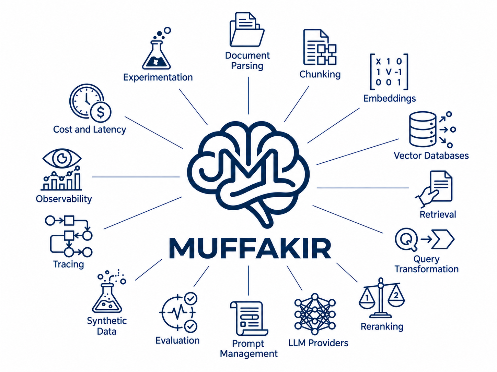

<p align="center">
  
</p>

<h1 align="center">Muffakir</h1>

<p align="center">
  <strong>Hyperparameter tuning for RAG systems.</strong>
</p>

<p align="center">
  Stop guessing which RAG pipeline will work. Search, evaluate, and compare<br>
  complete architectures in one local experimentation workspace.
</p>

<p align="center">
  <a href="#start-tuning-with-composerui"><strong>Launch ComposerUI</strong></a>
  ·
  <a href="https://mohamed28112003.github.io/Muffakir/">Documentation</a>
  ·
  <a href="https://youtu.be/SOXkpL4Q9PE"><strong>Video Walkthrough</strong></a>
  ·
  <a href="#python-api">Python API</a>
  ·
  <a href="https://github.com/Mohamed28112003/Muffakir">GitHub</a>
</p>

<p align="center">
  
  
  
  
</p>

---

RAG performance is rarely controlled by one model. It emerges from the entire
pipeline: how documents are split, how queries are transformed, which embeddings
are used, how candidates are retrieved and reranked, how much context reaches the
LLM, and how the final answer is prompted.

**Muffakir turns those decisions into a measurable search space.** Its main
experience, **ComposerUI**, lets you configure candidate components, run reproducible
trials, evaluate every pipeline on the same dataset, and identify the best setup for
your quality, latency, and cost requirements.

```text
Your corpus + evaluation dataset
                ↓
      Define a RAG search space
                ↓
 Chunking × Embeddings × Retrieval × Reranking × Top-K × Query Transform × LLM
                ↓
      Run and evaluate each trial
                ↓
 Best configuration + comparisons + traces + reports
```

## Why Muffakir?

Building one RAG pipeline is easy. Knowing whether it is the right pipeline is the
hard part.

- **Tune the complete architecture.** Compare chunk sizes, embedding models, vector
  stores, retrieval strategies, rerankers, query transformations, Top-K values, and
  LLMs from one search space.
- **Measure instead of guess.** Rank trials with retrieval and generation metrics,
  including Recall, Precision, MRR, nDCG, faithfulness, answer correctness, and the
  semantic LLM Judge Rating.
- **Understand every result.** Inspect resolved configurations, generated queries,
  retrieved chunks, answers, refusals, stage timings, token usage, cost, and errors.
- **Find practical trade-offs.** Compare quality against latency and cost, and inspect
  Pareto-optimal configurations rather than choosing from one score alone.
- **Run locally and keep control.** ComposerUI stores runs, checkpoints, reports, and
  traces in your workspace. Credentials are supplied locally.
- **Experiment in any language.** Muffakir includes Arabic and English prompts out of
  the box, and prompt overrides support other languages and domain-specific behavior.

## ComposerUI: the RAG tuning workspace

ComposerUI is the fastest way to use Muffakir. It brings the complete experiment
loop into a visual workflow—no experiment orchestration code required.

<p align="center">
  <a href="https://www.youtube.com/watch?v=SOXkpL4Q9PE" target="_blank">
    
  </a>
  <br>
  <em>▶️ Click above to watch the full walkthrough & demo on YouTube</em>
</p>

With ComposerUI, you can:

1. Choose a document corpus and provide an evaluation dataset, or generate one from
   your own documents.
2. Configure LLM, embedding, vector database, parser, reranker, web-search, and judge
   providers.
3. Select the RAG hyperparameters and component alternatives you want to compare.
4. Review the exact number of resolved trials before execution.
5. Run trials in parallel with maximum-trial and runtime limits.
6. Monitor progress, scores, latency, cost, failures, and checkpoints.
7. Open any trial or sample to inspect its configuration, generated queries, context,
   answer, evaluation results, and trace.
8. Export any saved trial to a Python script or starter project, with its selected
   configuration, runtime prompts, dependencies, and environment-variable setup.
9. Keep the generated JSON report and export trial data through the Python API.

### Take your selected trial into code

Open any trial and select **Export Python** to preview, copy, or download its code.
Choose **Download project ZIP** for a Python application, requirements, `.env.example`,
and setup instructions. Supply your documents and credentials, then run:

```bash
python rag_app.py --index
python rag_app.py --question "What does our documentation say?"
```

Web-search-only exports skip the indexing step. The application runs the selected
pipeline without repeating Composer's search. Failed trials can also be exported for
debugging when their configuration is available.

[Read the Python export guide](https://mohamed28112003.github.io/Muffakir/evaluate/python-export/).

### What can Composer tune?

| Search dimension | Examples |
| --- | --- |
| Chunking | Recursive, character, token, and contextual recursive; size and overlap |
| Embeddings | Multiple local Hugging Face embedding models |
| Vector database | Chroma, FAISS, Qdrant, Milvus, and Pinecone |
| Retrieval | Similarity search, MMR, hybrid, and contextual retrieval |
| Query transformation | None, rewrite, multi-query, decomposition, HyDE, and step-back |
| Reranking | None, semantic similarity, BM25, Hugging Face cross-encoder/pointwise, and LLM reranking |
| Retrieval depth | Multiple Top-K values |
| Generation | Provider/model variants with temperature, output-token limits, and supported sampling settings |

Tune the answer model without changing your judge. ComposerUI's **Advanced LLM settings**
lets you configure each LLM role independently; **Generation model variants** lets you
duplicate a model and compare different parameter sets. Settings appear in trial details
and carry into Python exports. [Configure LLM parameters](https://mohamed28112003.github.io/Muffakir/build/llm-providers-ui/#advanced-llm-settings).

Composer expands only meaningful combinations. For example, Hugging Face reranker
models multiply cross-encoder and pointwise trials without duplicating rerankers that
do not use those models. Compatible indexes are shared between trials to avoid
unnecessary parsing and embedding work.

## Beyond a static RAG pipeline

### Adaptive RAG: answer from your corpus, reach for the web when needed

Most RAG applications have two failure modes: they either answer from weak local
context, or always pay the latency and cost of web search. **Adaptive RAG gives the
pipeline a decision point.** It retrieves from your local corpus first, grades whether
the retrieved context is sufficient, and falls back to live web search only when the
local evidence is weak.

In ComposerUI, choose **Adaptive RAG: Corpus + Web**, select Firecrawl, Tavily, or
SerpAPI, and evaluate the behavior alongside the rest of the pipeline. Each trial
records web-search usage, cited sources, relevance-check and web-search latency, cost,
and the final context source. This makes fallbacks measurable instead of invisible.

```text
Question → retrieve local documents → is the evidence sufficient?
                                      ├─ yes → answer from corpus
                                      └─ no  → search the web → answer with fresh sources
```

For a pure web-backed agent, choose **Web Search Only** instead. It skips local
indexing entirely and evaluates answers built from live search results.

> [Configure Adaptive RAG and web search](https://mohamed28112003.github.io/Muffakir/build/web-search/)
> for provider setup, citations, resilience behavior, and Python examples.

### Synthetic data: turn documents into an evaluation dataset

Good RAG tuning needs a trustworthy benchmark. When you do not have labeled
question-answer pairs yet, Muffakir can generate a grounded starting dataset directly
from your documents. It parses and chunks the corpus, generates Q&A pairs against each
source chunk, validates them, checkpoints progress, and exports the result for review.

In ComposerUI, select **Generate a synthetic dataset** while creating a run. The
generated `question`, `answer`, and source `context` are then used to evaluate every
candidate pipeline on the same data. You can also use `MuffakirSyntheticData` from
Python for dataset creation outside Composer.

```python
import os
from Muffakir import MuffakirSyntheticData

generator = MuffakirSyntheticData({
    "data_dir": "./knowledge-base",
    "llm_provider": "openai",
    "llm_model": "gpt-4o-mini",
    "api_key": os.environ["OPENAI_API_KEY"],
    "language": "en",  # Arabic, English, or a prompt override for another language
    "output_dir": "./synthetic-evaluation",
})

dataset = generator.generate_dataset(max_chunks=200)
print(f"Generated {len(dataset)} grounded Q&A pairs.")
```

Synthetic data is a fast way to bootstrap experiments, not a substitute for expert
review. Curate the generated pairs and keep a separate reviewed holdout dataset for
release decisions.

> [Read the synthetic-data guide](https://mohamed28112003.github.io/Muffakir/guides/synthetic-data/)
> for validation, checkpoints, output formats, and prompt customization.

## Start tuning with ComposerUI

Muffakir requires Python 3.11 or later. The `standard` installation includes
ComposerUI, local embeddings, Chroma, common LLM providers, evaluation datasets, and
the core RAG components.

### Windows PowerShell

```powershell
py -m venv .venv
.\.venv\Scripts\Activate.ps1
python -m pip install --upgrade pip
pip install "Muffakir[standard]"
muffakir serve --open
```

### macOS / Linux

```bash
python3 -m venv .venv
source .venv/bin/activate
python -m pip install --upgrade pip
pip install "Muffakir[standard]"
muffakir serve --open
```

### Conda

```bash
conda create --name muffakir python=3.11 -y
conda activate muffakir
python -m pip install --upgrade pip
pip install "Muffakir[standard]"
muffakir serve --open
```

ComposerUI opens at [http://127.0.0.1:2811](http://127.0.0.1:2811). If Windows has
reserved port `2811`, use another port:

```bash
muffakir serve --port 2812 --open
```

Then create a run, select the dimensions to tune, review the generated trial matrix,
and launch the search.

> [Read the ComposerUI guide](https://mohamed28112003.github.io/Muffakir/getting-started/composer-ui/)
> for the complete visual workflow.

## The Composer workflow

### 1. Define the experiment

Use your own corpus and a grounded evaluation dataset with `question`, `context`, and
`answer` fields. If you do not have one yet, Muffakir can generate synthetic Q&A pairs
from the corpus.

### 2. Build the search space

Choose only the decisions you want to test. A small experiment might compare two
retrieval methods, two rerankers, and three Top-K values. Composer resolves that space
into reproducible RAG trials and shows the count before running.

### 3. Select the objective

Evaluate retrieval, final-answer quality, or both. Metric weights produce a normalized
composite score, while raw metric values remain available for analysis. The 1–5 LLM
Judge Rating is normalized only when it contributes to the composite.

### 4. Run, inspect, and choose

Composer executes trials in parallel, reuses compatible indexes, checkpoints progress,
and can resume interrupted searches. The result view highlights the winning setup and
lets you investigate every sample behind the aggregate score.

## Two tuning modes

| Mode | Use it when | What runs |
| --- | --- | --- |
| **Full RAG** | You need to optimize end-to-end answer quality | Retrieval, generation, retrieval metrics, and optional LLM judge metrics |
| **Retrieval only** | You want faster, lower-cost tuning of the retrieval stack | Chunking, embeddings, retrieval, reranking, query transformation, and retrieval metrics—without answer generation |

Muffakir also supports vector-database retrieval, adaptive web-search fallback, and a
web-search-only flow for experiments that do not use a local corpus.

## Python API

Prefer code? `MuffakirComposer` exposes the same tuning workflow through a
scikit-learn-like `fit()` interface.

```python
import os

from Muffakir import MuffakirComposer

composer = MuffakirComposer(
    config={
        "data_dir": "./knowledge-base",
        "llm_provider": "openai",
        "llm_model": "gpt-4.1-mini",
        "api_key": os.environ["OPENAI_API_KEY"],
        "embedding_provider": "sentence_transformers",
        "embedding_model": "mohamed2811/Muffakir_Embedding",
        "vector_db_provider": "chroma",
        "language": "en",
    }
)

report = composer.fit(
    search_space={
        "chunking": [
            {"method": "recursive", "size": 500, "overlap": 50},
            {"method": "recursive", "size": 800, "overlap": 100},
        ],
        "query_expansion": ["none", "rewrite", "hyde"],
        "retrieval": ["similarity_search", "hybrid"],
        "reranking": ["none", "cross_encoder"],
        "reranking_model": ["BAAI/bge-reranker-base", "BAAI/bge-reranker-v2-m3"],
        "k": [3, 5, 8],
    },
    eval_dataset="./evaluation.csv",
    metrics=["recall", "mrr", "faithfulness", "llm_judge_rating"],
    metric_weights={
        "recall": 0.25,
        "mrr": 0.15,
        "faithfulness": 0.30,
        "llm_judge_rating": 0.30,
    },
    n_jobs=4,
    max_trials=30,
    checkpoint_dir="./muffakir_checkpoints",
    report_path="./muffakir_report.json",
)

print("Best score:", report.best_score)
print("Best configuration:", report.best_config)
```

The Python package also provides focused public facades for building and evaluating
individual systems:

| Facade | Purpose |
| --- | --- |
| `MuffakirRAG` | Build an end-to-end RAG application |
| `MuffakirRetrieval` | Evaluate and use retrieval without generation |
| `MuffakirEvaluation` | Score an existing RAG system or dataset |
| `MuffakirComposer` | Search RAG architectures and hyperparameters |
| `MuffakirSearch` | Run web-backed retrieval and generation |
| `MuffakirSyntheticData` | Generate grounded evaluation Q&A datasets |
| `MuffakirPrompt` | Manage localized and custom prompt templates |

## Providers and integrations

### Ecosystem integrations

Muffakir is designed to compose proven AI and infrastructure tools into one
experiment workflow. Install only the optional extras your deployment uses.

| Layer | Integrated libraries and services |
| --- | --- |
| RAG foundation | LangChain Core, LangChain Community, and LangChain Text Splitters |
| Local ML and model hub | Hugging Face-compatible models through Sentence Transformers, including embedding models and CrossEncoder rerankers |
| ComposerUI | FastAPI and Uvicorn for the local workspace server |
| Data and evaluation | Pandas and OpenPyXL for tabular evaluation datasets and exports |
| Vector infrastructure | Chroma, FAISS, Qdrant, Milvus, and Pinecone |
| Document intelligence | Docling, LlamaParse, Azure Document Intelligence, and built-in extraction/OCR workflows |
| Web research | Firecrawl, Tavily, and SerpAPI |
| LLM integrations | OpenAI, Groq, Anthropic, Google Gemini, Ollama, Cohere, plus OpenAI-compatible services such as Together, OpenRouter, and DeepSeek |

- **LLMs:** OpenAI, Groq, Together, OpenRouter, Anthropic, Gemini, Ollama, Azure
  OpenAI, DeepSeek, and custom OpenAI-compatible endpoints.
- **Embeddings:** local Sentence Transformers, OpenAI, Cohere, and arbitrary compatible
  Hugging Face model IDs.
- **Vector databases:** Chroma, FAISS, Qdrant, Milvus, and Pinecone.
- **Document parsing:** built-in extraction, Docling, LlamaParse, and Azure Document
  Intelligence, with OCR support.
- **Reranking:** BM25, embedding similarity, Hugging Face cross-encoders, pointwise
  models, LLM judges, and custom HTTP endpoints.
- **Web search:** Firecrawl, Tavily, and SerpAPI.

Install only what your deployment needs:

```bash
pip install Muffakir                              # Minimal package
pip install "Muffakir[standard]"                 # Recommended ComposerUI setup
pip install "Muffakir[all]"                      # Every optional integration
pip install "Muffakir[rag,local,qdrant,openai]"  # Focused environment
```

## Evaluation and observability

Muffakir is designed to explain *why* a configuration won, not just name it.

| Capability | What you can inspect |
| --- | --- |
| Retrieval evaluation | Recall, Precision, MRR, and nDCG |
| Generation evaluation | Faithfulness, answer correctness, and LLM Judge Rating (1–5) |
| Query visibility | Original question and every generated/transformed query |
| Refusal observability | Refusal count and rate for answers such as “I cannot answer” |
| Performance | Per-stage and end-to-end latency |
| Usage | Input/output tokens and estimated LLM cost |
| Tracing | Retrieved chunks, answer, metrics, errors, and resolved configuration per sample |
| Reporting | Run summaries, JSON and HTML reports, plus DataFrame/CSV export through the Python API |

## Multilingual by design

Muffakir ships with Arabic and English prompt templates and supports mixed-language
content. It is not limited to those languages: override the prompts while preserving
their required variables to adapt generation, evaluation, query transformation, and
synthetic-data workflows to another language or domain.

## Documentation

- [Install Muffakir](https://mohamed28112003.github.io/Muffakir/getting-started/installation/)
- [Tune with ComposerUI](https://mohamed28112003.github.io/Muffakir/getting-started/composer-ui/)
- [Understand Composer search](https://mohamed28112003.github.io/Muffakir/evaluate/composer/)
- [Choose LLM providers](https://mohamed28112003.github.io/Muffakir/build/llm-providers/)
- [Configure embeddings, retrieval, and reranking](https://mohamed28112003.github.io/Muffakir/build/)
- [Evaluate RAG quality](https://mohamed28112003.github.io/Muffakir/evaluate/evaluation/)
- [Inspect traces and observability](https://mohamed28112003.github.io/Muffakir/evaluate/observability/)
- [Browse the public API](https://mohamed28112003.github.io/Muffakir/reference/api/)
- [Troubleshoot common issues](https://mohamed28112003.github.io/Muffakir/help/troubleshooting/)

## Development installation

```bash
git clone https://github.com/Mohamed28112003/Muffakir.git
cd Muffakir
pip install -e ".[standard]"
```

To preview the documentation locally:

```bash
pip install -r requirements-docs.txt
mkdocs serve
```

## Contributing

Issues, provider integrations, documentation improvements, and reproducible RAG
benchmarks are welcome. Please open an issue before starting a large architectural
change so the work can be coordinated.

## Contact

- Email: [mohamedtawfik28112003@gmail.com](mailto:mohamedtawfik28112003@gmail.com)
- LinkedIn: [Mohamed Khaled](https://www.linkedin.com/in/mohamedkhaled2811)

---

<p align="center">
  <strong>Tune the pipeline. Measure the trade-offs. Build better RAG.</strong>
</p>
