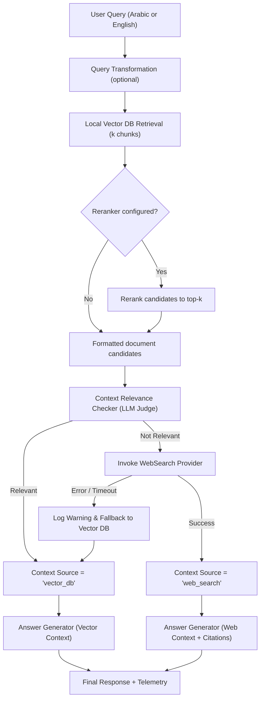

# Adaptive web search

Muffakir can supplement a local corpus with live web results when retrieved documents do
not contain sufficient, relevant evidence for a trustworthy answer. In addition, Muffakir
provides a standalone web-search facade (`MuffakirSearch`) for zero-corpus question
answering and search evaluation.

---

## Quick start

### Adaptive RAG fallback (`MuffakirRAG`)

When `adaptive_web_search=True`, Muffakir first retrieves local documents. If the
relevance checker grades the retrieved context as insufficient, Muffakir automatically
queries the web search provider, incorporates fresh web context, and cites web sources.

```python
import os
from Muffakir import MuffakirRAG

rag = MuffakirRAG(
    data_dir="./knowledge-base",
    # Adaptive web search activation
    adaptive_web_search=True,
    search_provider="tavily",
    search_provider_config={
        "api_key": os.environ["TAVILY_API_KEY"],
        "max_results": 5,
    },
    # Core RAG configuration
    llm_provider="openai",
    llm_model="gpt-4o-mini",
    api_key=os.environ["OPENAI_API_KEY"],
    embedding_provider="sentence_transformers",
    embedding_model="mohamed2811/Muffakir_Embedding",
    k=4,
)

# For a query outside the local knowledge base, Muffakir transparently falls back to web search
response = rag.ask("ما هي أحدث التطورات في نماذج اللغة العربية مفتوحة المصدر هذا الشهر؟")

print(f"Answer: {response['answer']}")
print(f"Context source: {response['context_source']}")  # "web_search" or "vector_db"
if response["context_source"] == "web_search":
    print("Web sources cited:")
    for source in response["web_sources"]:
        print(f"- {source['title']}: {source['url']}")
```

### Standalone web search QA (`MuffakirSearch`)

When your application does not require a local document index (e.g. general intelligence,
live news summaries, or external fact checking), use the `MuffakirSearch` facade directly:

```python
import os
from Muffakir import MuffakirSearch

search_agent = MuffakirSearch({
    "search_provider": "tavily",
    "search_provider_config": {
        "api_key": os.environ["TAVILY_API_KEY"],
        "max_results": 5,
    },
    "llm_provider": "openai",
    "llm_model": "gpt-4o-mini",
    "api_key": os.environ["OPENAI_API_KEY"],
    "language": "ar",
})

result = search_agent.ask("ما هي مواعيد مباريات المنتخب السعودي القادمة؟")
print(result["answer"])
```

### Direct provider instantiation (`create_web_search_provider`)

For custom pipelines, you can instantiate any web search engine independently:

```python
import os
from WebSearch import create_web_search_provider

provider = create_web_search_provider(
    provider="firecrawl",
    api_key=os.environ["FIRECRAWL_API_KEY"],
    max_depth=2,
    time_limit=30,
    max_urls=5,
)

search_result = provider.search("تطور الذكاء الاصطناعي التوليدي في العالم العربي")
print(f"Found {len(search_result.sources)} sources:")
for s in search_result.sources:
    print(f"- {s['title']} ({s['url']})")
print(f"\nExtracted context:\n{search_result.content[:500]}...")
```

---

## Architecture and decision flow

In `MuffakirRAG`, adaptive web search functions as an autonomous guardrail against
knowledge gaps and stale documentation:



### Safety and fallback resilience

If the external web search provider fails (e.g. network timeout, rate limit, or invalid
API key), Muffakir records an error in the trace telemetry and **safely falls back** to
the local vector context rather than crashing the pipeline. The `context_source` remains
`"vector_db"` and generation proceeds with the best available local evidence.

---

## Supported web search providers

Muffakir supports three search backends via optional extras:

| Provider | Search strategy | Primary strength | Extra package | Supported aliases |
| --- | --- | --- | --- | --- |
| `tavily` | AI-optimized snippet search | Fast, low latency, clean extracted text snippets | `Muffakir[tavily]` | `tavily` |
| `firecrawl` | Deep research web crawler | Multi-page recursive scraping and markdown synthesis | `Muffakir[firecrawl]` | `firecrawl`, `fire_crawl`, `fire-crawl` |
| `serpapi` | Live Google search SERP | Broadest web coverage, answer boxes, organic results | `Muffakir[serpapi]` | `serpapi`, `serp_api`, `serp-api`, `google` |

You can also install all web search providers at once using:

```bash
pip install "Muffakir[websearch]"
```

---

### `tavily` — AI-native web search

**Best for:** Production RAG applications needing low-latency, high-precision snippets
tailored specifically for LLM context windows.

Under the hood, `TavilyWebSearchProvider` uses `langchain-tavily` (`TavilySearchResults`).
It automatically normalizes structured results into cleaned text passages with source URLs.

#### Parameters

| Parameter | Type | Default | Description |
| --- | --- | --- | --- |
| `api_key` | `str` | `os.getenv("TAVILY_API_KEY")` | Tavily API credential. |
| `max_results` | `int` | `5` | Maximum number of search snippets to retrieve. |

#### Usage example

```python
from WebSearch import create_web_search_provider

tavily_provider = create_web_search_provider(
    provider="tavily",
    api_key="tvly-...",  # or set TAVILY_API_KEY in environment
    max_results=5,
)

result = tavily_provider.search("رؤية السعودية 2030 مشاريع الطاقة المتجددة")
print(result.content)
```

---

### `firecrawl` — Deep research and scraping

**Best for:** In-depth queries that require crawling linked documentation, reading full
articles, and synthesizing comprehensive answers from complex sites.

`FirecrawlWebSearchProvider` uses `firecrawl-py` (`FirecrawlApp.deep_research`). It
initiates an asynchronous multi-url crawl, extracts clean markdown, and aggregates
references.

#### Parameters

| Parameter | Type | Default | Description |
| --- | --- | --- | --- |
| `api_key` | `str` | *Required* | Firecrawl API credential (or top-level `fire_crawl_api`). |
| `max_depth` | `int` | `2` | Maximum crawl depth from initial seed URLs. |
| `time_limit` | `int` | `30` | Maximum crawl duration in seconds before returning results. |
| `max_urls` | `int` | `5` | Maximum unique URLs to scrape during the deep research session. |

#### Usage example

```python
from WebSearch import create_web_search_provider

firecrawl_provider = create_web_search_provider(
    provider="firecrawl",
    api_key="fc-...",
    max_depth=2,
    time_limit=30,
    max_urls=5,
)

result = firecrawl_provider.search("مقارنة بين أحدث معالجات الهواتف الذكية لعام 2026")
print(f"Content:\n{result.content}")
print(f"Sources: {result.sources}")
```

---

### `serpapi` — Google search engine results

**Best for:** High-coverage Google searches, live news, and questions benefiting from
Google's Answer Box or Knowledge Graph snippets.

`SerpAPIWebSearchProvider` interfaces with `google-search-results` and `langchain-community`.
It extracts organic results, title headers, snippets, links, and Google Answer Boxes when
available.

#### Parameters

| Parameter | Type | Default | Description |
| --- | --- | --- | --- |
| `api_key` | `str` | `os.getenv("SERPAPI_API_KEY")` | SerpAPI credential. |
| `max_results` | `int` | `5` | Maximum organic search results to extract. |

#### Usage example

```python
from WebSearch import create_web_search_provider

serp_provider = create_web_search_provider(
    provider="serpapi",
    api_key="...",  # or set SERPAPI_API_KEY in environment
    max_results=5,
)

result = serp_provider.search("سعر صرف الدرهم الإماراتي اليوم")
print(result.content)
```

---

## Response structure and telemetry

When adaptive web search triggers or `MuffakirSearch` is queried, the returned response
dictionary contains detailed telemetry and source attribution:

```python
response = rag.ask("ما هي مواعيد معرض الرياض الدولي للكتاب القادم؟")
```

The response contains:

| Key | Type | Description |
| --- | --- | --- |
| `answer` | `str` | The generated answer in the requested language. |
| `context_source` | `str` | Either `"vector_db"` (answered from local documents) or `"web_search"` (answered from web fallback). |
| `retrieved_documents` | `List[Document]` | Local documents retrieved by the vector store (empty if web search was used, ensuring unreferenced local docs are not falsely attributed). |
| `source_metadata` | `List[Dict]` | Normalized source list containing `title` and `url`. |
| `web_sources` | `List[Dict]` | Web sources with `title` and `url` when `context_source == "web_search"`. |
| `used_context` | `str` | The exact context string passed to the LLM for answer generation. |
| `stage_timings_ms` | `Dict[str, float]` | Per-stage latency breakdown including `relevance_check_ms` and `web_search_ms`. |
| `pipeline_latency_ms`| `float` | Total end-to-end execution time in milliseconds. |

### Inspecting stage timings

You can easily measure how much time was spent on relevance evaluation vs web crawling:

```python
timings = response["stage_timings_ms"]

print(f"Vector search:       {timings.get('vector_search_ms', 0):.1f} ms")
print(f"Relevance check:     {timings.get('relevance_check_ms', 0):.1f} ms")
if response["context_source"] == "web_search":
    print(f"Web search latency:  {timings.get('web_search_ms', 0):.1f} ms")
print(f"Generation latency:  {timings.get('generation_ms', 0):.1f} ms")
print(f"Total pipeline time: {response['pipeline_latency_ms']:.1f} ms")
```

---

## Standalone web search with `MuffakirSearch`

`MuffakirSearch` coordinates web search retrieval directly with `LLMProvider` and
`MuffakirPrompt`. It implements two interfaces:

1. **`search(query)`**: Returns the raw dictionary with `answer`, `sources`, `context`,
   `stage_timings_ms`, and `pipeline_latency_ms`.
2. **`ask(question, **kwargs)`**: An `EvalRunner`-compatible adapter that matches
   `MuffakirRAG.ask()`. This allows web-search-only pipelines to be evaluated with
   the standard Muffakir evaluation harness.

```python
from Muffakir import MuffakirSearch

search_agent = MuffakirSearch(
    config={
        "search_provider": "tavily",
        "search_provider_config": {"api_key": os.environ["TAVILY_API_KEY"]},
        "llm_provider": "openai",
        "llm_model": "gpt-4o-mini",
        "api_key": os.environ["OPENAI_API_KEY"],
        "llm_temperature": 0.2,
        "language": "ar",
    }
)

# Application querying
res = search_agent.ask("ما هي أهم الابتكارات في مؤتمر LEAP التقني في الرياض؟")
print(res["answer"])
```

### Evaluation compatibility

Because `MuffakirSearch` implements `.ask()`, it can be passed directly to
`MuffakirEvaluation`:

```python
from Muffakir import MuffakirEvaluation

evaluator = MuffakirEvaluation(
    metrics=["faithfulness", "answer_correctness", "llm_judge_rating"],
    eval_model="gpt-4o",
    api_key=os.environ["OPENAI_API_KEY"],
)

report = evaluator.evaluate(
    rag_instance=search_agent,
    dataset="./arabic_web_eval_dataset.json",
)
print(report.summary())
```

> [!NOTE]
> Retrieval metrics that require a ground-truth document corpus (`recall`, `precision`,
> `mrr`, `ndcg`) are not applicable to web search. If requested on a `MuffakirSearch` instance,
> Muffakir raises a descriptive `ConfigurationError` advising the use of generation metrics
> (`faithfulness`, `answer_correctness`, or `llm_judge_rating`) instead.

---

## Building a custom web search provider

To integrate a proprietary search engine, an intranet enterprise index, or another public
API (e.g. Bing Search or DuckDuckGo), subclass `BaseWebSearchProvider` and return a
`WebSearchResult`:

```python
from typing import List, Dict, Any
from WebSearch.base import BaseWebSearchProvider
from WebSearch.models import WebSearchResult

class CustomIntranetSearchProvider(BaseWebSearchProvider):
    """Custom search provider querying an internal enterprise API."""

    def __init__(self, endpoint_url: str, auth_token: str, max_results: int = 5):
        self.endpoint_url = endpoint_url
        self.auth_token = auth_token
        self.max_results = max_results

    def search(self, query: str) -> WebSearchResult:
        import requests

        response = requests.post(
            self.endpoint_url,
            headers={"Authorization": f"Bearer {self.auth_token}"},
            json={"query": query, "top_k": self.max_results},
            timeout=10,
        )
        response.raise_for_status()
        data = response.json()

        # Format context and sources
        content = "\n\n".join(item["text"] for item in data["results"])
        sources = [
            {"title": item["title"], "url": item["link"]}
            for item in data["results"]
        ]

        return WebSearchResult(content=content, sources=sources)
```

You can then pass your custom provider directly to `Search` or wrap it into your
pipeline orchestrator.

---

## See also

- [Retrieval and vector stores](retrieval.md) — Configuring local vector databases and retrieval methods.
- [Reranking](reranking.md) — Reranking local candidate passages prior to relevance assessment.
- [Query transformation](query-transformers.md) — Rewriting or decomposing queries before search.
- [LLM providers](llm-providers.md) — Configuring generation backends and credentials.
- [Observability](../evaluate/observability.md) — Inspecting stage telemetry, error rates, and traces.
- [Configuration reference](../reference/configuration.md) — Full configuration parameter schema.
- [Public Python API](../reference/api.md#websearch) — Signatures for `MuffakirSearch`, `create_web_search_provider`, and providers.
