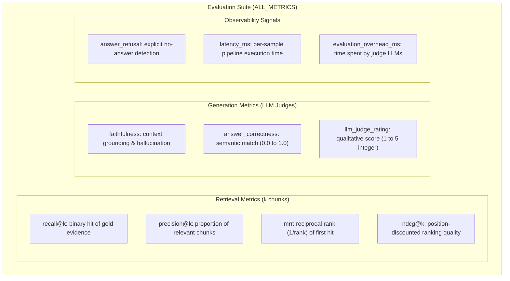

# Evaluation

Evaluation turns RAG pipelines and search configurations into measurable evidence. Muffakir
features a native, comprehensive evaluation framework engineered specifically for Arabic
and multilingual RAG, supporting retrieval benchmarking, context grounding (faithfulness),
semantic answer correctness, and qualitative LLM judge ratings.

---

## Quick start

### Evaluating a RAG pipeline

```python
import os
from Muffakir import MuffakirRAG, MuffakirEvaluation

# 1. Initialize your RAG system
rag = MuffakirRAG(
    data_dir="./knowledge-base",
    llm_provider="openai",
    llm_model="gpt-4o-mini",
    api_key=os.environ["OPENAI_API_KEY"],
    embedding_provider="sentence_transformers",
    embedding_model="mohamed2811/Muffakir_Embedding",
    k=5,
)

# 2. Configure the evaluation suite
evaluator = MuffakirEvaluation(
    config={
        "language": "ar",
        "metrics": [
            "recall",
            "precision",
            "mrr",
            "ndcg",
            "faithfulness",
            "answer_correctness",
            "llm_judge_rating",
        ],
        "k": 5,
        # Optional: Use a stronger independent judge model for scoring
        "llm_provider": "openai",
        "llm_model": "gpt-4o",
        "api_key": os.environ["OPENAI_API_KEY"],
    }
)

# 3. Run evaluation across a test dataset
report = evaluator.evaluate(
    rag=rag,
    dataset="./arabic_rag_eval.jsonl",
    save=True,
    output_dir="./eval_results",
)

# 4. View aggregated metrics
print(report)
print("\nAggregate summary dictionary:")
for metric, score in report.summary().items():
    print(f"  {metric}: {score:.4f}")
```

---

## Metric taxonomy and scoring formulas

Muffakir distinguishes between **Retrieval Metrics** (measuring how well the vector
database and reranker locate ground-truth chunks) and **Generation Metrics** (measuring
grounding and answer correctness).



### Retrieval metrics

Retrieval metrics require candidate chunks and a ground-truth reference context.

| Metric | Target | Formula / Logic | Description |
| --- | --- | --- | --- |
| `recall` | Retrieval accuracy | $\mathbb{I}(\text{hit} \in \text{top-}k)$ | Binary single-gold recall: `1.0` if any retrieved document in the top-$k$ matches the gold context; `0.0` otherwise. |
| `precision` | Chunk density | $\frac{\sum_{i=1}^k \text{rel}_i}{k}$ | Proportion of retrieved chunks that match the ground-truth reference passage. |
| `mrr` | First hit position | $\frac{1}{\text{rank}_{\text{first}}}$ | Mean Reciprocal Rank: $1/\text{rank}$ of the highest-ranked relevant document. If no relevant document is retrieved, score is `0.0`. |
| `ndcg` | Ranking order | $\frac{\text{DCG}_k}{\text{IDCG}_k}$ | Normalized Discounted Cumulative Gain: rewards systems that place the most relevant evidence in the earliest ranks. |

### Generation metrics

Generation metrics evaluate the synthesized answer against the retrieved evidence and the
reference ground-truth answer.

| Metric | Target | Judge Scale | Description |
| --- | --- | --- | --- |
| `faithfulness` | Context grounding | `0.0` or `1.0` | Evaluated via `ContextGroundingChecker`. Tests whether every statement in the generated answer is strictly grounded in the retrieved context (`1.0` = grounded, `0.0` = hallucination). |
| `answer_correctness` | Semantic similarity | `0.0` – `1.0` | Evaluated via LLM-as-a-judge against the reference gold answer. Compares semantic meaning and factual coverage rather than exact lexical phrasing. |
| `llm_judge_rating` | Qualitative score | `1` – `5` integer | Discrete 5-point rubric measuring semantic correctness, completeness, and contradictions. Reports mean as `x.x / 5`. |

---

## LLM Judge Rating vs. Answer Correctness

Muffakir provides two distinct answer-correctness judges designed for different analysis
needs:

| Feature | `answer_correctness` | `llm_judge_rating` |
| --- | --- | --- |
| **Output Type** | Continuous `float` (`0.0` to `1.0`) | Discrete `int` (`1` to `5`) |
| **Default Set** | Enabled by default in `DEFAULT_METRICS` | Opt-in (added to `ALL_METRICS`) |
| **Prompt Focus** | Factual alignment and coverage | Multi-tier rubric rating quality and severity |
| **Best Used For** | Automated composite scoring in Composer | Human-interpretable audits and benchmark reports |
| **Judge Call Cost** | 1 independent LLM call per sample | 1 independent LLM call per sample |

### 5-Point Judge Rubric

When `llm_judge_rating` is enabled, the judge LLM scores answers using this standardized
contract:

| Rating | Classification | Evaluation Criteria |
| :---: | :--- | :--- |
| **1** | Completely Incorrect | Irrelevant, completely wrong, or hallucinated with no correct facts. |
| **2** | Mostly Incorrect | Contains a minimal trace of factual information, but mostly incorrect or misleading. |
| **3** | Partially Correct | Contains important correct facts, but misses vital details or introduces contradictions. |
| **4** | Mostly Correct | Accurate and aligned with reference answer, with only trivial omissions or stylistic variance. |
| **5** | Fully Correct | Completely accurate, factually comprehensive, and semantically identical to reference answer. |

> [!TIP]
> Both metrics can be selected simultaneously. If both are enabled, Muffakir runs two
> independent judge calls with `temperature=0.0` to ensure strict impartiality.

---

## Dataset formats and preparation

The evaluation dataset requires three primary fields:
1. `question`: The input query in Arabic or English.
2. `answer`: The ground-truth (gold) reference answer.
3. `context`: The reference source text / ground-truth evidence chunk.

`MuffakirEvaluation` natively accepts multiple file types and in-memory structures via
`load_evaluation_dataset`:

### Supported file formats

```python
# 1. JSON Lines (.jsonl) - Recommended for streaming and large datasets
evaluator.evaluate(rag=rag, dataset="./eval_dataset.jsonl")

# 2. Comma-Separated Values (.csv)
evaluator.evaluate(rag=rag, dataset="./eval_dataset.csv")

# 3. Excel Spreadsheets (.xlsx, .xls)
evaluator.evaluate(rag=rag, dataset="./eval_dataset.xlsx")

# 4. JSON Array (.json)
evaluator.evaluate(rag=rag, dataset="./eval_dataset.json")

# 5. In-memory Pandas DataFrame
import pandas as pd
df = pd.DataFrame([
    {
        "question": "ما هي شروط الحضانة في القانون الكويتي؟",
        "answer": "يشترط في الحاضن العقل، والبلوغ، والأمانة على المحضون...",
        "context": "المادة 189 من قانون الأحوال الشخصية تنص على...",
    }
])
evaluator.evaluate(rag=rag, dataset=df)

# 6. SyntheticData output (List of QAPair objects)
from SyntheticData import MuffakirSyntheticData
synth = MuffakirSyntheticData({"data_dir": "./docs", ...})
qa_pairs = synth.generate_dataset(num_samples=25)
evaluator.evaluate(rag=rag, dataset=qa_pairs)
```

---

## Arabic text matching and relevance scoring

Retrieval metrics (`recall`, `precision`, `mrr`, `ndcg`) determine whether a retrieved
chunk matches the gold context using a resilient, multi-stage strategy:

1. **Chunk ID Matching**: If both the retrieved document and gold sample contain a chunk
   identifier (`chunk_id`, `chunkId`, or `id` in metadata), an exact integer match is
   evaluated first.
2. **Arabic Text Normalization**: When matching by raw context text, `normalize_text`
   standardizes Arabic orthography:
   - Unicode NFKC normalization.
   - Letter unification: `أ`, `إ`, `آ` $\to$ `ا`; `ة` $\to$ `ه`; `ى` $\to$ `ي`.
   - Whitespace and diacritic collapse.
3. **Fuzzy Token Overlap**: Token-level Jaccard similarity and substring checks are applied
   with an overlap threshold of `0.55`.

This ensures that slight token boundary variances between document chunking algorithms do
not falsely penalize retrieval accuracy.

---

## Answer refusal detection and observability

When a RAG system correctly detects that it lacks sufficient context and refuses to guess,
penalizing it as a hallucination or failure is misleading.

Muffakir includes built-in refusal pattern matching (`detect_answer_refusal`) covering both
standard Arabic and English refusal templates:
- **Arabic**: `"لا تتوفر لدي معلومات كافية"`, `"لا يمكنني الإجابة على هذا السؤال استناداً إلى السياق المتاح"`, etc.
- **English**: `"I cannot answer this question based on the provided context"`, `"Insufficient information"`, etc.

When an answer refusal is detected:
- The sample record flags `answer_refusal: True` and sets `answer_refusal_reason: "insufficient_information"`.
- In Composer runs and observability traces, this surfaces in `error_rates.json` as `answer_refusal_rate`, allowing you to diagnose corpus coverage gaps directly.

---

## Pipeline modes: Full RAG vs. Retrieval-only

Muffakir allows evaluating retrieval indices in isolation without spending LLM tokens on
answer generation:

```python
# Evaluate retrieval only using MuffakirRetrieval
from Muffakir import MuffakirRetrieval, MuffakirEvaluation

retrieval_engine = MuffakirRetrieval({
    "data_dir": "./knowledge-base",
    "vector_db_provider": "qdrant",
    "embedding_provider": "sentence_transformers",
    "embedding_model": "mohamed2811/Muffakir_Embedding",
    "k": 5,
})

evaluator = MuffakirEvaluation({
    "metrics": ["recall", "precision", "mrr", "ndcg"],
    "k": 5,
})

report = evaluator.evaluate(rag=retrieval_engine, dataset="./eval_dataset.jsonl")
print(report)
```

> [!NOTE]
> Attempting to request generation metrics (`faithfulness`, `answer_correctness`,
> `llm_judge_rating`) on a `retrieval_only` pipeline raises a descriptive `ValueError`,
> preventing accidental token waste or invalid score reports.

---

## Independent Judge LLM configuration

To avoid self-evaluation bias, you can configure `MuffakirEvaluation` with a dedicated,
higher-capacity judge model (such as GPT-4o or Claude 3.5 Sonnet) while evaluating a
smaller or locally hosted application LLM (such as Llama 3.3 or Ollama):

```python
evaluator = MuffakirEvaluation(
    config={
        "language": "ar",
        "metrics": ["faithfulness", "answer_correctness", "llm_judge_rating"],
        # Independent evaluation judge credentials
        "llm_provider": "openai",
        "llm_model": "gpt-4o",
        "api_key": os.environ["OPENAI_API_KEY"],
        "llm_temperature": 0.0,
    }
)
```

If no override LLM is specified in `MuffakirEvaluation`, the evaluator automatically reuses
the RAG pipeline's existing `llm_provider`.

---

## Report inspection and export

The returned `EvaluationReport` provides multiple inspection and export utilities:

```python
report = evaluator.evaluate(rag=rag, dataset="./eval.jsonl", save=True, output_dir="./run_01")

# 1. Summary dictionary of float scores
summary = report.summary()
print(f"Overall Recall@5: {summary.get('recall_at_k', 0):.2%}")
print(f"Overall Faithfulness: {summary.get('faithfulness', 0):.2%}")

# 2. Convert to Pandas DataFrame for in-depth slice analysis
df = report.to_dataframe()

# Inspect samples where the model hallucinated
hallucinated = df[df["faithfulness"] == 0.0]
print(f"Found {len(hallucinated)} hallucinated responses:")
for _, row in hallucinated.iterrows():
    print(f"Q: {row['question']}")
    print(f"Predicted: {row['predicted_answer']}")
    print(f"Context snippet: {row['gold_context'][:100]}...\n")

# 3. Analyze latency overhead
print(f"Mean Pipeline Latency: {df['pipeline_latency_ms'].mean():.1f} ms")
print(f"Mean Judge Overhead:   {df['evaluation_overhead_ms'].mean():.1f} ms")
```

### Export files layout

When `save=True` or `report.save(output_dir)` is called, Muffakir writes two artifacts
using atomic filesystem replacements (`tempfile` + `os.replace`):

```text
eval_results/
├── summary.json     # High-level run metadata, k count, and aggregated scores
└── samples.csv      # Complete per-sample diagnostic dataset with all metrics & timings
```

#### `summary.json` example

```json
{
  "n_samples": 50,
  "k": 5,
  "metrics_enabled": ["recall", "precision", "mrr", "faithfulness", "answer_correctness"],
  "retrieval": {
    "recall_at_k": 0.94,
    "precision_at_k": 0.38,
    "mrr": 0.82,
    "ndcg_at_k": 0.86
  },
  "generation": {
    "faithfulness": 0.96,
    "answer_correctness": 0.91
  },
  "summary": {
    "recall_at_k": 0.94,
    "precision_at_k": 0.38,
    "mrr": 0.82,
    "ndcg_at_k": 0.86,
    "faithfulness": 0.96,
    "answer_correctness": 0.91
  }
}
```

---

## See also

- [Composer optimization](../evaluate/composer.md) — Automating RAG hyperparameter search over evaluation metrics.
- [Traces and observability](../evaluate/observability.md) — Analyzing per-sample traces, stage timings, and error rates.
- [Synthetic data generation](../guides/synthetic-data.md) — Generating evaluation datasets directly from Arabic corpora.
- [Configuration reference](../reference/configuration.md#evaluation-and-composer) — Complete evaluation parameter keys.
- [Public Python API](../reference/api.md#muffakirevaluation) — Signatures for `MuffakirEvaluation`, `EvalRunner`, and `EvaluationReport`.
