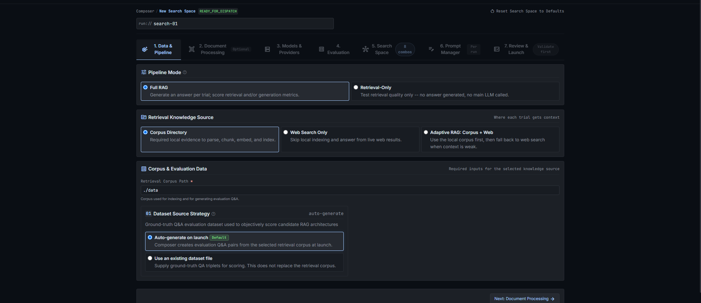
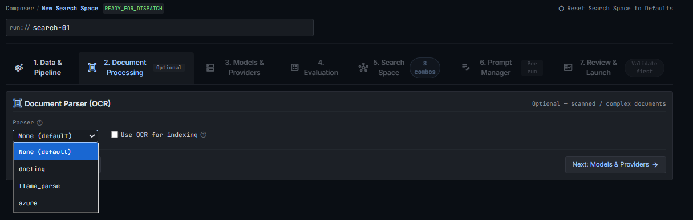
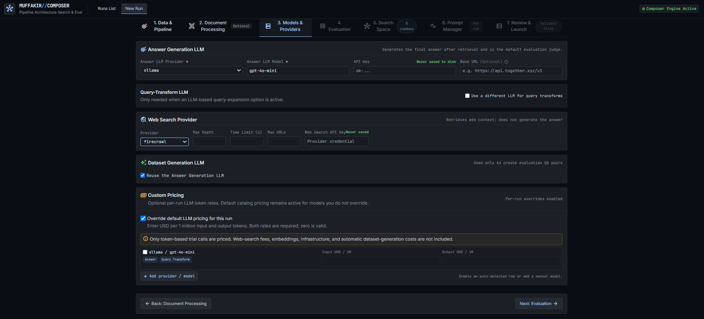
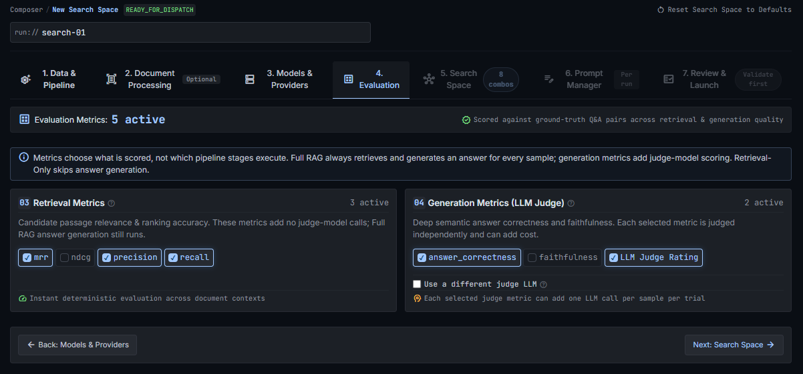
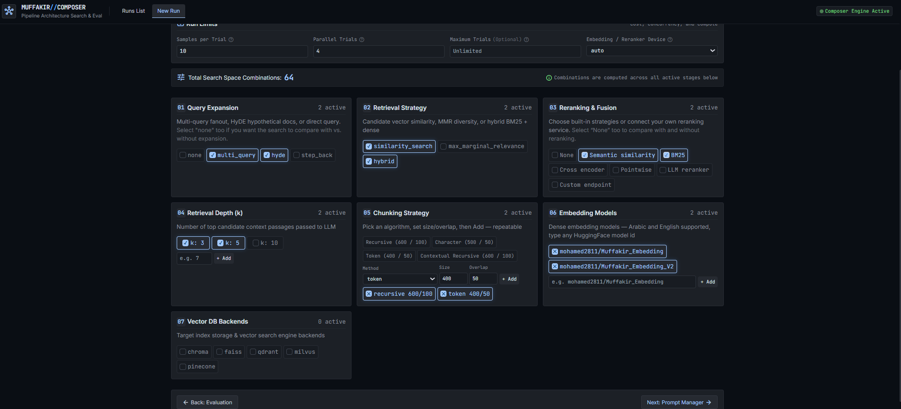
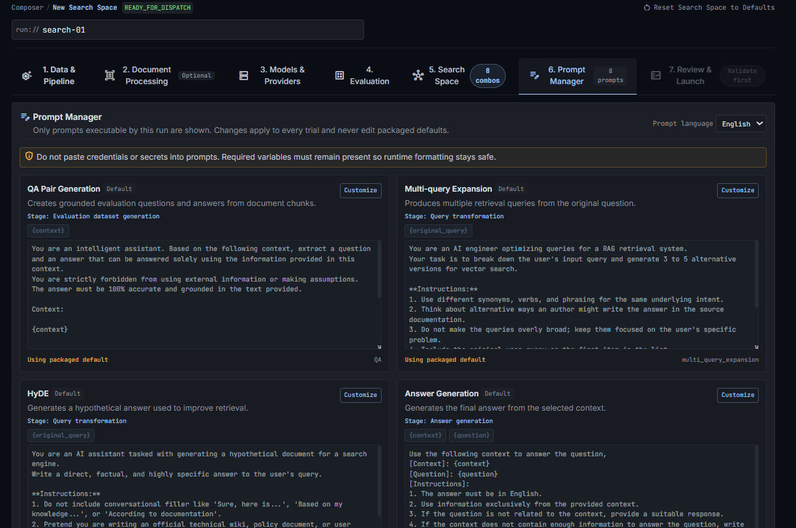
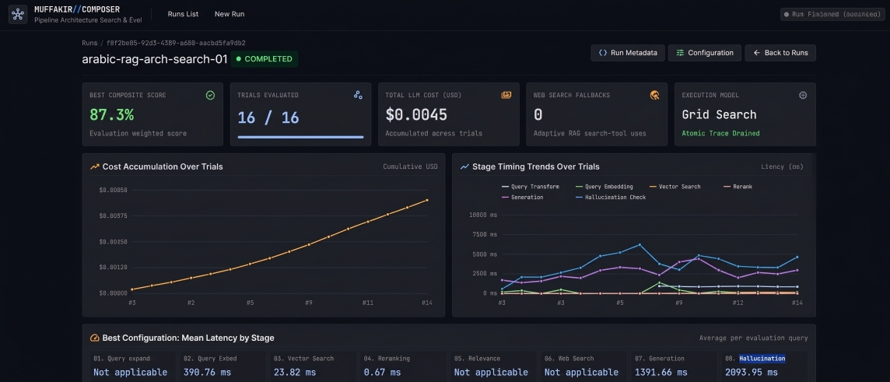

# ComposerUI

ComposerUI is the official visual workspace for Muffakir. It provides an intuitive,
web-based interface to design search spaces, configure pipelines, run automated
hyperparameter evaluations, monitor live trials, and analyze winning architectures without
writing orchestration boilerplate.

<div style="position: relative; width: 100%; padding-bottom: 56.25%; margin: 1.5rem 0; border-radius: 8px; overflow: hidden; box-shadow: 0 4px 14px rgba(0,0,0,0.15);">
  <iframe 
    src="https://www.youtube-nocookie.com/embed/SOXkpL4Q9PE" 
    title="Muffakir & ComposerUI Video Walkthrough" 
    style="position: absolute; top: 0; left: 0; width: 100%; height: 100%; border: 0;" 
    allow="accelerometer; autoplay; clipboard-write; encrypted-media; gyroscope; picture-in-picture; web-share" 
    allowfullscreen>
  </iframe>
</div>

---

## Starting the server

To install the optional web interface dependencies and start ComposerUI:

```bash
pip install "Muffakir[ui]"
muffakir ui
```

> [!TIP]
> You can also use the alias `muffakir serve`. ComposerUI runs on `http://127.0.0.1:2811` by default.
> If that port is already in use on your machine, specify a custom port:
> ```bash
> muffakir serve --port 2812 --open
> ```

Once launched, navigate to `http://127.0.0.1:2811` in your browser.

---

## Step 1: Data & Pipeline Configuration

The first step establishes your RAG pipeline mode, retrieval knowledge source, and evaluation data.

{ .screenshot }

### Pipeline Mode

- **Full RAG**: Evaluates the complete end-to-end pipeline (document retrieval followed by LLM answer generation). Computes retrieval metrics plus generation metrics (`faithfulness`, `answer_correctness`, and `llm_judge_rating`).
- **Retrieval Only**: Evaluates candidate retrieval without invoking the answer-generation LLM. Ideal for quickly benchmarking vector databases, embeddings, chunk sizes, and rerankers while saving LLM API tokens and runtime.

### Retrieval Knowledge Source

- **Corpus Directory**: Evaluates documents from a local knowledge base (e.g. PDF, Word, or text files) indexed into your vector store.
- **Web Search Only**: Zero-corpus mode that evaluates live external search engines (Tavily, Firecrawl, SerpAPI) directly.
- **Adaptive RAG (Corpus + Web)**: Hybrid fallback mode. Muffakir queries the local corpus first; if the context relevance checker grades retrieved documents as insufficient, it automatically invokes the web search provider and cites web sources.

### Corpus & Evaluation Data

- **Corpus Directory**: The file system path containing your raw documents.
- **Evaluation Dataset Options**:
  - **Auto-generate on launch**: Automatically invokes an LLM to generate synthetic Arabic/English Q&A evaluation pairs directly from your corpus before search trials begin.
  - **Use an existing dataset file**: Supply a path to a pre-existing test dataset in `.jsonl`, `.csv`, `.xlsx`, or `.json` format.

---

## Step 2: Document Processing & OCR

The second step configures document ingestion, text extraction, and OCR engines.

{ .screenshot }

### Document Parsers

- **Structured Library (Default)**: Fast, zero-credential local parsers using standard Python document libraries (PyPDF, PDFPlumber, Unstructured, docx2txt). Best for clean digital PDFs, Word documents, and text files.
- **Azure Document Intelligence**: Microsoft cloud parser providing high-precision Arabic OCR, form layout extraction, and table structure recognition.
- **Docling (IBM)**: Advanced open-source parser specialized in layout recognition, reading order preservation, and clean Markdown extraction for dense technical and tabular documents.
- **LlamaParse**: Specialized LLM-optimized cloud parser designed for complex multi-column documents and presentation decks.

### Parser Options

- **OCR Language Codes**: Set language priorities (e.g. `ara`, `eng`).
- **Table Structure Recognition**: Enables structured table parsing into markdown or HTML representations.
- **API Credentials**: Supply endpoints and keys for cloud-based OCR providers.

---

## Step 3: Models & Providers

The third step defines your default generation LLM, embedding models, and vector database backends.

{ .screenshot }

### Generation LLM

- **Supported Providers**: OpenAI, Together AI, Groq, Anthropic, Google Gemini, Ollama (local models), and vLLM / custom OpenAI-compatible endpoints.
- **Shared Parameters**: Configure validated LLM parameters including `temperature`, `max_tokens` (labeled **Maximum output tokens**), `top_p`, `stop` (as a list of strings), `seed`, `top_k`, `frequency_penalty`, `presence_penalty`, `timeout_seconds`, and `max_retries` (labeled **Provider request retries**). See [LLM providers in ComposerUI](../build/llm-providers-ui.md) for complete provider capabilities.

### Embeddings & Vector Storage

- **Embedding Provider**: Select between Sentence Transformers / Hugging Face local embeddings (e.g. `mohamed2811/Muffakir_Embedding`), OpenAI embeddings, or Cohere.
- **Hardware Acceleration**: Set device preference (`auto`, `cuda`, `cpu`).
- **Vector Database**: Choose your backend—`chroma` (embedded local store), `qdrant` (high-performance vector engine), `faiss` (in-memory indexing), `milvus`, or `pinecone`.

---

## Step 4: Evaluation Metrics & Judges

The fourth step configures the evaluation suite and scoring weights used to rank candidate architectures.

{ .screenshot }

### Metric Selection

- **Retrieval Metrics**:
  - `recall`: Binary single-gold hit in top-k chunks.
  - `precision`: Proportion of retrieved chunks relevant to the gold context.
  - `mrr`: Mean Reciprocal Rank (1/rank) of the first relevant chunk.
  - `ndcg`: Normalized Discounted Cumulative Gain accounting for position discount.
- **Generation Metrics**:
  - `faithfulness`: Strict context grounding verification (detects hallucinations).
  - `answer_correctness`: Continuous semantic similarity score (0.0 to 1.0) against reference answers.
  - `llm_judge_rating`: Discrete 1–5 integer rubric measuring factual accuracy and completeness.

### Metric Weights & Composite Scoring

Use the interactive sliders to assign weights to each active metric. Composer calculates a normalized composite score (`0.0` to `1.0`) for each trial:

```text
Composite Score = (w₁ × Score₁) + (w₂ × Score₂) + ... + (wₙ × Scoreₙ)
```

- Each weight (`w`) is normalized automatically so all assigned weights sum to 1.0 (100%).
- Candidate architectures on the leaderboard are ranked by their final composite score.
- **LLM Judge Rating** (1–5 scale) is linearly normalized to `0.0 – 1.0` when factoring into the composite score (Rating 1 = `0.0`, Rating 3 = `0.5`, Rating 5 = `1.0`), while its raw score (`x.x / 5`) is preserved in reports and detail views.

### Independent Evaluation Judge

To eliminate evaluation bias, you can configure an independent, high-capacity judge model (such as GPT-4o or Claude 3.5 Sonnet) specifically for grading generation metrics, even when testing smaller or locally hosted models in the RAG pipeline.

---

## Step 5: Search Space & Constraints

The fifth step defines the combinatorial hyperparameter grid to explore.

{ .screenshot }

### Search Space Dimensions

Select the options you wish to benchmark across your pipeline stages:

- **Query Expansion**: `none`, `rewrite`, `multi_query`, `decomposition`, `hyde`, `step_back`.
- **Retrieval Strategies**: `similarity_search`, `max_marginal_relevance` (MMR), `hybrid` (dense + BM25), `contextual`.
- **Reranking Methods**: `none`, `semantic_similarity`, `bm25`, `cross_encoder`, `pointwise`, `llm`.
- **Reranker Models**: Local Hugging Face models (e.g. `BAAI/bge-reranker-base`, `BAAI/bge-reranker-v2-m3`). Composer intelligently expands models only for model-based rerankers without creating redundant trials for other methods.
- **Top-k Depths**: Test different candidate chunk quantities (e.g. `3`, `5`, `8`, `10`).

### Live Combination Counter

The badge in the tab bar updates in real time to display the total number of trial combinations formed by your selections.

### Execution Controls

- **Worker Processes (`n_jobs`)**: Adjust the number of parallel workers for multi-core evaluation.
- **Max Trials**: Set an optional cap to terminate search after N evaluated trials.
- **Max Runtime**: Specify a maximum wall-clock runtime in minutes.

---

## Step 6: Prompt Manager

The sixth step allows live inspection and fine-tuning of system prompts across all stages.

{ .screenshot }

### Features

- **Base Language**: Toggle between Arabic (`ar`) and English (`en`) prompt bases.
- **Stage Customization**: Inspect and customize default prompt templates for:
  - Answer generation (`rag_prompt`)
  - Query transformation (`query_rewrite`, `multi_query_expansion`, `hyde`, `step_back`)
  - Evaluation judges (`answer_correctness`, `llm_judge_rating`, `context_grounding`)
- **Placeholder Contract Validation**: ComposerUI automatically validates that required prompt placeholders (such as `{context}` and `{question}`) are preserved, preventing runtime formatting errors.

---

## Step 7: Review & Launch

Before launching, the review panel presents a complete summary of your run configuration, active providers, and estimated trial count.

Click **Dispatch Run** to launch the search in the background. Completed trials are saved atomically to checkpoints, allowing runs to be paused, resumed, or recovered seamlessly.

---

## Final Results & Diagnostics

Once a run is launched or completed, the Run Details page provides comprehensive analytics, trade-off curves, and diagnostic drilldowns.

{ .screenshot }

### 1. Winning Architecture Card

The top banner highlights the optimal pipeline configuration with the highest composite score, displaying its trial ID, composite score, and exact hyperparameter choices.

### 2. Trials Leaderboard

An interactive, sortable table listing all evaluated trials:
- **Composite Score**: Overall ranking score.
- **Individual Metrics**: Per-metric scores (`recall`, `faithfulness`, `answer_correctness`, `llm_judge_rating`).
- **Performance & Cost**: End-to-end pipeline latency, evaluation overhead, token counts, and estimated dollar costs.

### 3. Pareto Frontier & Multi-Objective Trade-Offs

The interactive Pareto chart plots **Quality (Composite Score) vs. Latency / Cost**. This helps identify architectures that provide the best speed-to-accuracy balance without being dominated by slower alternatives.

### 4. Sample-Level Inspector

Click into any trial to inspect individual evaluation queries:
- See the original question and gold answer.
- Inspect the transformed query generated during search.
- Review retrieved chunk previews and source attributions.
- Check whether the model triggered an **Answer Refusal** (`answer_refusal: True/False`).

### 5. Error Rate Observability

The observability panel monitors error rates across trials:
- Groups failures by error code and exception type.
- Tracks provider rate limits, network timeouts, or invalid judge responses.
- Displays dataset generation failures and refusal rates.

### 6. Export a Trial to Python

In the trial inspector, click **Export Python** to turn any evaluated trial configuration into a runnable, production-ready project:
- **Code Preview & Copy**: Inspect the generated `rag_app.py` script directly in the UI.
- **Download Python (`rag_app.py`)**: Download the standalone pipeline script.
- **Download Project ZIP**: Get a complete project archive containing `rag_app.py`, `requirements.txt`, `.env.example`, `.gitignore`, and a setup `README.md`.

See the dedicated [Export a trial to Python guide](../evaluate/python-export.md) for instructions on running and deploying exported projects.

### 7. Artifact Downloads

Download search run data directly from the UI:
- **Summary JSON**: Machine-readable run configuration and aggregate metrics.
- **Samples CSV**: Full row-level diagnostic spreadsheet with per-sample scores and timings for offline analysis.

---

## See also

- [Composer search guide](../evaluate/composer.md) — Programmatic Python API and search space mechanics.
- [Export a trial to Python](../evaluate/python-export.md) — Exporting any saved trial into a runnable project.
- [Evaluation guide](../evaluate/evaluation.md) — Deep dive into metric mathematics and judge rubrics.
- [Traces and observability](../evaluate/observability.md) — Detailed trial trace files and error monitoring.
- [Public Python API](../reference/api.md#muffakircomposer) — `MuffakirComposer` class reference.
